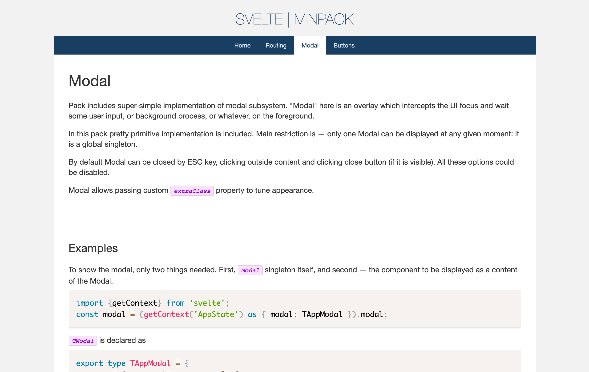

# Svelte minimal starter pack

This is my boilerplate for different Admin UIs and simple projects implemented with Svelte.

It includes very basic things: infrastructure and very basic set of UI, literally only buttons and modals.

## Infrastructure

* [Webpack](https://webpack.js.org/) as a builder,
* [TypeScript](https://www.typescriptlang.org/) as main language,
* [LESS](http://lesscss.org/) as a stylesheet preprocessor (rather basic, so could by easily replaced with SASS or whatever),
* [Svelte](https://svelte.dev/), and</li>
* [ESLint](https://eslint.org/) as a linter.

## Things included

* [Svelte routing](https://github.com/EmilTholin/svelte-routing),
* [Press.CSS](https://press-css.io/) buttons,
* [Prism.js](https://prismjs.com/index.html) for syntax highlight.

## Installation

1. Clone the repository.
2. Run 'npm install' in the local copy (I hope you have NodeJS and NPM installed =)
3. Use one of:
   * `npm run build` for production build
   * `npm run dev` for development build (no minification)
   * `npm run watch` for development build + watch mode
   * `npm run start` for live server on `http://localhost:3030/`
   * `docker*` (see below)

## Screenshot



## Docker

To generate `dist` folder without installing NPM packages and adding local garbage, use these commands:

1. Build image: `docker build -f Dockerfile.prod -t svelte-min-pack .` in the project folder.
2. Run container: `docker run --name temp svelte-min-pack`
3. Copy `dist` folder from container: `docker cp temp:/app/dist ./dist`
4. Remove the container: `docker rm temp`
5. Remove the image: `docker image rm svelte-min-pack`

OR

1. Run `docker_build.cmd` script.

### Docker compose

#### Production mode

In root folder run `docker-compose up` to build the files. Result will be placed into `dist` folder.

#### Development + watch mode

In root folder run `docker-compose -f docker-compose.watch.yml up` to build the files. Result will be placed into `dist` folder and Webpack will start watching.

`node_modules` and `dist` folders will be mapped.

#### Development + online mode

In root folder run `docker-compose -f docker-compose.start.yml up` to build the files. Result will be placed into `dist` folder and application will start
watching. Webserver will be available on URL `localhost:3030`.

`node_modules` and `dist` folders will be mapped.

### CLI (with local NPM install)

1. `npm i`
2. `npm run build` or `npm run dev`
3. `npm run watch` to start watching.
3. `npm run start` to run dev webserver.

## Configuration

### Garbage

To clean up unused things (pages, 3rd party components) you need to delete:

* `src/styles/syntax-example.less` - styles for example pages Note: remove `@import "syntax-example";` line from `src/styles/index.less` file.

* `src/pages/home/HomePage.svelte` - syntax highlight component
* `src/assets/prism` folder - syntax highlight engine (prism)
* Unnecessary files: `src/pages/*` folders.

### Routing

Routing in the application uses two files: `src/config/Routing.svelte`   and `src/pages/home/HomePage.svelte`.

First one is a _physical_ routing: declaration of available routes:

```html

<script lang="ts">
	import {Route} from 'svelte-routing';
	import HomePage from '../pages/home/HomePage.svelte';
	import ModalPage from '../pages/modal/ModalPage.svelte';
	import ButtonsPage from '../pages/buttons/ButtonsPage.svelte';
	import RoutingPage from '../pages/routing/RoutingPage.svelte';
	import RoutingParameterizedPage from '../pages/routing/RoutingParameterizedPage.svelte';
	import RoutingSecondaryPage from '../pages/routing/RoutingSecondaryPage.svelte';
</script>

<div class="app-pages">
	<Route path="buttons" component="{ButtonsPage}"/>
	<Route path="routing" component="{RoutingPage}"/>
	<Route path="routing/secondary" component="{RoutingSecondaryPage}"/>
	<Route path="routing/:user/:record" let:params component="{RoutingParameterizedPage}"/>
	<Route path="modal" component="{ModalPage}"/>
	<Route path="home" component="{HomePage}"/>
	<Route path="/">
		<HomePage/>
	</Route>
</div>
```

Second file is declaration of routes which are _displayed in main menu_:

```ts
export const menuRoutes = [
	['home', 'Home'], // [route, title]
	['routing', 'Routing'],
	['modal', 'Modal'],
	['buttons', 'Buttons'],
];
```

So you need only to create your pages and declare them here.

Good luck!
